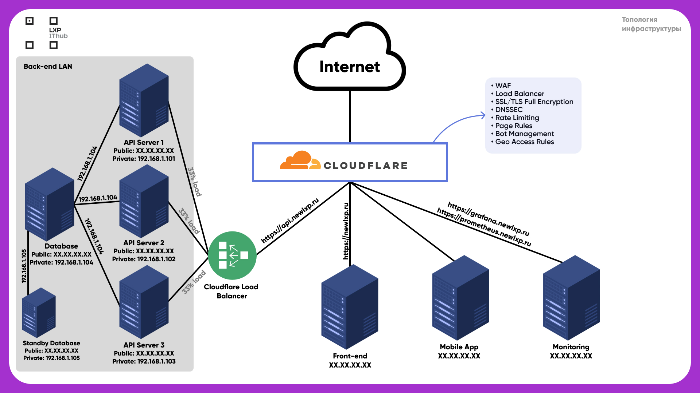

# IThub LXP Infra Setup

*Документация по развертке серверной инфраструктуры [newlxp.ru](http://newlxp.ru)*

---

### Топология серверов



[topology.pdf](documentation/topology.pdf)

---

**IThub LXP Front-end Server:**

- Общая информация
    
    ```bash
    IP: XX.XX.XX.XX
    
    OS: Debian 11 (64-bit)
    Processor: 10 cores
    Memory: 16 GB
    Storage: 120 GB
    ```
    
- Данные для SSH-подключения
    
    ```bash
    Host: XX.XX.XX.XX
    User: ****
    Password: ****
    ```
    

---

**IThub LXP Test Front-end Server:**

- Общая информация
    
    ```bash
    IP: XX.XX.XX.XX
    
    OS: Debian 11 (64-bit)
    Processor: 8 cores
    Memory: 8 GB
    Storage: 80 GB
    ```
    
- Данные для SSH-подключения
    
    ```bash
    Host: XX.XX.XX.XX
    User: ****
    Password: ****
    ```
    

---

**IThub LXP Mobile App Server:**

- Общая информация
    
    ```bash
    IP: XX.XX.XX.XX
    
    OS: Debian 11 (64-bit)
    Processor: 2 x 2.8 GHz
    Memory: 4096 MB
    Storage: 40 GB
    Bandwidth: 100 Mbps (Monthly limit: 8 TB)
    ```
    
- Данные для SSH-подключения
    
    ```bash
    Host: XX.XX.XX.XX
    User: ****
    Password: ****
    ```
    

---

**IThub LXP Monitoring Server:**

- Общая информация
    
    ```bash
    IP: XX.XX.XX.XX
    
    OS: Debian 11 (64-bit)
    Processor: 2 x 2.8 GHz
    Memory: 4096 MB
    Storage: 40 GB
    Bandwidth: 100 Mbps (Monthly limit: 8 TB)
    ```
    
- Данные для SSH-подключения
    
    ```bash
    Host: monitoring.servers.newlxp.ru
    User: ****
    Password: ****
    ```
    

---

**IThub LXP API Server 1:** 

- Общая информация
    
    ```bash
    Public IP (Internet): XX.XX.XX.XX
    Private IP (Back-end LAN): 192.168.1.101
    
    OS: Debian 11 (64-bit)
    Processor: 3 x 2.8 GHz
    Memory: 8192 MB
    Storage: 80 GB
    Bandwidth: 100 Mbps
    ```
    
- Данные для SSH-подключения
    
    ```bash
    Host: back-1.servers.newlxp.ru
    User: ****
    Password: ****
    ```
    

---

**IThub LXP API Server 2:**

- Общая информация
    
    ```bash
    Public IP (Internet): XX.XX.XX.XX
    Private IP (Back-end LAN): 192.168.1.102
    
    OS: Debian 11 (64-bit)
    Processor: 3 x 2.8 GHz
    Memory: 8192 MB
    Storage: 80 GB
    Bandwidth: 100 Mbps
    ```
    
- Данные для SSH-подключения
    
    ```bash
    Host: back-2.servers.newlxp.ru
    User: ****
    Password: ****
    ```
    

---

**IThub LXP API Server 3:**

- Общая информация
    
    ```bash
    Public IP (Internet): XX.XX.XX.XX
    Private IP (Back-end LAN): 192.168.1.103
    
    OS: Debian 11 (64-bit)
    Processor: 3 x 2.8 GHz
    Memory: 8192 MB
    Storage: 80 GB
    Bandwidth: 100 Mbps
    ```
    
- Данные для SSH-подключения
    
    ```bash
    Host: back-3.servers.newlxp.ru
    User: ****
    Password: ****
    ```
    

---

**IThub LXP Database Server:**

- Общая информация
    
    ```bash
    Public IP (Internet): XX.XX.XX.XX
    Private IP (Back-end LAN): 192.168.1.104
    
    OS: Debian 11 (64-bit)
    Processor: 3 x 2.8 GHz
    Memory: 8192 MB
    Storage: 80 GB
    Bandwidth: 100 Mbps
    ```
    
- Данные для SSH-подключения
    
    ```bash
    Host: db.servers.newlxp.ru
    User: ****
    Password: ****
    ```
    

---

**IThub LXP Standby Database Server:**

- Общая информация
    
    ```bash
    Public IP (Internet): XX.XX.XX.XX
    Private IP (Back-end LAN): 192.168.1.105
    
    OS: Debian 11 (64-bit)
    Processor: 2 x 2.8 GHz
    Memory: 4096 MB
    Storage: 40 GB
    Bandwidth: 100 Mbps (Monthly limit: 8 TB)
    ```
    
- Данные для SSH-подключения
    
    ```bash
    Host: db-standby.servers.newlxp.ru
    User: ****
    Password: ****
    ```
    

---

### Конфигурация серверов

[Конфигурация iptables и fail2ban](documentation/iptables-fail2ban.md)

[Конфигурация развертки Front-end](documentation/frontend.md)

[Конфигурация развертки Back-end](documentation/backend.md)

---

### Быстрые гайды

- **Как запустить фронт-енд**
    1. Зайти на **IThub LXP Monitoring Server:** 
    2. Ввести команду `cd ~/servers-ansible-setup/deploy-front`
    3. Ввести команду `ansible-playbook -i inventory.ini deploy_front.yml`
    
    По результату выполнения данных действий сервер мониторинга подтянет исходники фронта с git-репозитория, перекинет на фронт-енд сервер, создаст .env файл, забилдит и запустит. Процесс можно будет просмотреть на фронт-енд сервере с помощью команды `pm2 status`
    
- **Как запустить телеграм-бота**
    1. Зайти на **IThub LXP Monitoring Server:**
    2. Ввести команду `cd ~/servers-ansible-setup/deploy-tgbot`
    3. Ввести команду `ansible-playbook -i inventory.ini deploy_tgbot.yml`
    
    По результату выполнения данных действий сервер мониторинга подтянет исходники телеграм-бота с git-репозитория, перекинет исходники на сервер тг-бота, забилдит и запустит. Процесс можно будет просмотреть на фронт-енд сервере с помощью команды `pm2 status`
    
- **Как запустить бек-енд**
    1. Зайти на **IThub LXP Monitoring Server:**
    2. Ввести команду `cd ~/servers-ansible-setup/deploy-back`
    3. Ввести команду `ansible-playbook -i inventory.ini deploy_back.yml`
    
    По результату выполнения данных действий сервер мониторинга подтянет исходники бек-енда с git-репозитория, перекинет исходники на **ВСЕ API-сервера**, создаст .env файл, сделает установку всех необходимых пакетов, создаст символическую ссылку “artisan storage:link” и запустит. Процесс можно будет просмотреть на бек-енд серверах с помощью команды `pm2 status`
    
- **Как зайти в Базу данных**
    1. Зайти на сервер **IThub LXP Database Server:**
    2. Прописать команду `mysql`
    3. Прописать `USE ithublxp_db;`
    
    Из этой среды можно выполнять SQL-запросы.
    

---

### Архив со всеми Ansible-конфигурациями

[ansible-configs.zip](ansible-configs/ansible_configs.zip)